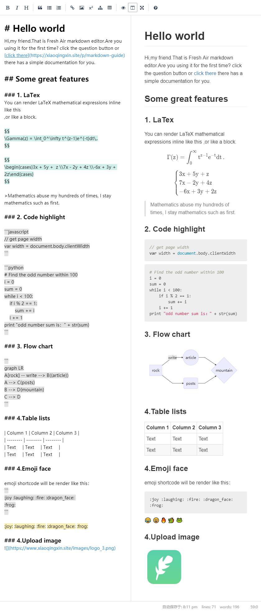
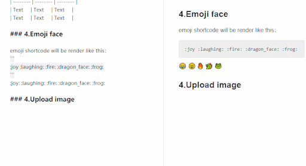
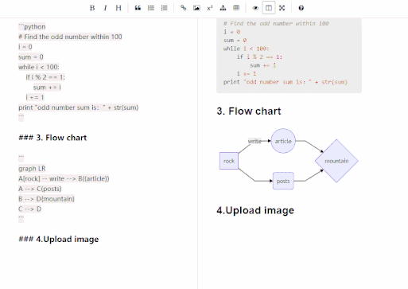

# Laravel-smartmd


<p align="center">
 <a href="./docs/docs_EN.md">Documentation</a> | <a href="./docs/docs_CN.md">中文文档</a>
</p>

<p align="center">
<a href="https://travis-ci.org/NoisyWinds/laravel-smartmd"></a>
<a href="LICENSE"></img></a>
<a href="https://laravel.com"></img></a>
<a href="https://packagist.org/packages/noisywinds/laravel-smartmd"></img></a>
</p>

A simple markdown editor compatible most markdown parse,You can choose any parse methods on server or client,like Mathematical formula、flowchart、upload image...
this program is a plugin for laravel 5.4 and php 7.1 upper.more feature develop now...    

##  Screenshots
editor demo: [Demo](https://xiaoqingxin.site/editor/write)   
js render page [Demo](https://xiaoqingxin.site/editor/js-show)  
php render page [Demo](https://xiaoqingxin.site/editor/php-show)
  
  
  --- 
   
  ---
  

Reference:
- CodeMirror [link](https://github.com/codemirror/CodeMirror) 
- Simplemde-markdown [link](https://github.com/sparksuite/simplemde-markdown-editor)
- markdown-it (markdown render) [link](https://github.com/markdown-it/markdown-it)
- mermaid (flowchart) [link](https://github.com/knsv/mermaid)
- intervention (image handling) [link](https://github.com/Intervention/image)

## requirements
- PHP >= 8.1.0
- Laravel >= 10.0.0

## Installation
First, install package.
```
composer require noisywinds/laravel-smartmd
```
Then run these commands to publish assets and config：
```
php artisan vendor:publish --provider="NoisyWinds\Smartmd\SmartmdServiceProvider"
```
make test view router:
```
Route::group(['namespace' => 'Smartmd', 'prefix' => 'editor'], function () {
    Route::post('/upload', 'UploadController@imSave');
    Route::get('/write', function () {
        return view('vendor/smartmd/write');
    });
    Route::get('/php-show','ParseController@index');
    Route::get('/js-show',function(){
        return view('vendor/smartmd/js-show');
    });
});
```
Rewrite UploadController or config/smartmd.php to change upload path:
```php
<?php
return [
    "image" => [
        /*
         * like filesystem, Where do you like to place pictures?
         */
        "root" => storage_path('app/public/images'),
        /*
         * return public image path
         */
        "url" => env('APP_URL').'/storage/images',
    ],
];
```
* notice: uploda image will optimize and resize in the UploadController

## Some shortcode
1. Bold (Ctrl + b)
2. Italic (Ctrl + I)
3. Insert Image (Ctrl + Alt + I)
4. Insert Math (Ctrl + m)
5. Insert flowchart (Ctrl + Alt + m)
6. more... (mac command the same with ctrl)


## editor options
```javascript
new Smartmd({
   // editor element {string} 
   el: "#editor",
   
   // editor wrapper layout {string or number}
   height: "400px",
   width: "100%",
   
   // autosave 
   autoSave: {
     // uuid is required {string or number}
     uuid: 1,
     // {number}
     delay: 5000
   },
   
   // init state {boolean}
   isFullScreen: true, // default false
   isPreviewActive: true // default false
});
```

## parse markdown 
#### I don't need editor:
```html
// require in your view meta
@include('Smartmd::js-parse')
```
```
<script>
    // create Parsemd object use javascript parse markdown
    var parse = new Parsemd();
    var html = parse.render(document.getElementById("editor").value.replace(/^\s+|\s+$/g, ''));
    document.getElementById("content").innerHTML = html;
</script>
```
#### I need editor:
```html
<script>
    var smartmd = new Smartmd();
    smartmd.markdown("# hello world");
</script>
```
#### I want php render:
* only render Formula、Flowchart、Code highlight use JavaScript
```html
// require in your view meta
@include('Smartmd::php-parse')
```
ParseController.php
```
use Parsedown;

$parse = new Parsedown();
$text = "# Your markdown text";
$html = $parse->text($text);
return view('Smartmd::php-show',['content'=>$html]);

```

## How to expand
#### editor
- CodeMirror [link](https://github.com/codemirror/CodeMirror) 
#### markdown render
- markdown-it (markdown render) [link](https://github.com/markdown-it/markdown-it)
## issue 
Welcome to ask questions or what features you want to be compatible with.

